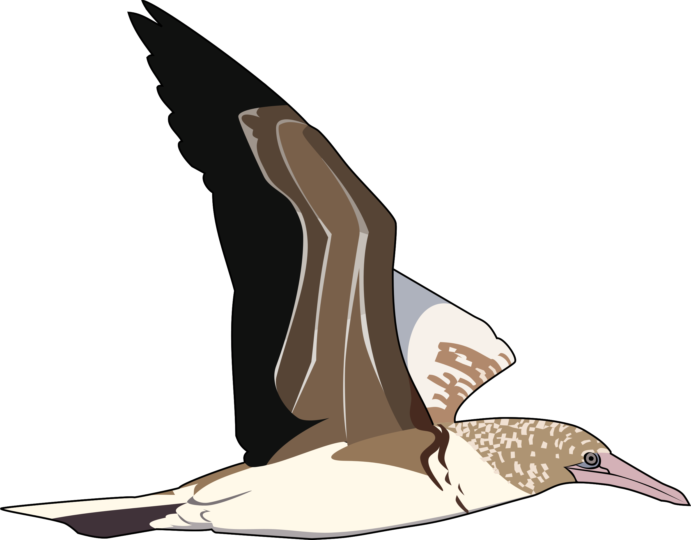
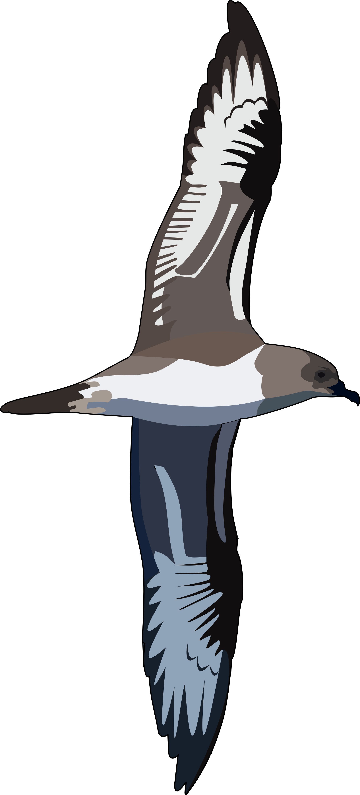

# ExMove
This toolkit is meant as an accessible introduction to analysing tracking data using R. We make use of the [tidyverse](https://www.tidyverse.org/packages/) collection and simple features ([sf](https://r-spatial.github.io/sf/index.html)) packages to read, clean and process multiple data files, ready for a range of analyses. Go to the workflow script by clicking [here](R/Workflow.R)

#### _Authors_:

- Liam Langley :dancer: 
- Stephen Lang :neckbeard: 
- Luke Ozsanlav-Harris :dizzy_face: 
- Alice Trevail :runner: 

### Don't want to use GitHub?

1.  Download the entire repo as a zipped file [here](https://github.com/AliceTrevail/Code-workshop/archive/refs/heads/main.zip), or by using `Code ▾` > `Download ZIP` above
2.  Unzip the folder to the desired location on your machine (`ExMove` folder name can be changed to whatever you want)
3.  Initiate the project opening the `ExMove.Rproj` file (which will open a new named instance of R Studio — which needs to be installed)
4.  Open the `Workflow.R` file, and start by running on one of our three example datasets (currently `RFB`, but can be changed to `RFB_IMM`,`TRPE`, or `GWFG`)
5.  To run analyses on your own data, start by copying a folder of data and metadata files into the `Data` folder (process described in `User guide`)
6.  All outputs of this workflow (such as figures, summaries and processed data) are saved into folders of `DataOutputs`
7.  If you run into issues when using your own data, the `Documentation` folder provides a `User Guide` and `FAQ's` for additional guidance

### Do want to use GitHub?

1.  Clone this repo (for additional GitHub guidance see: [setting up GitHub](https://intro2r.com/setup_git.html) | [cloning a repo](https://intro2r.com/setting-up-a-project-in-rstudio.html) | [using GitHub with RStudio](https://intro2r.com/use_git.html))
2.  Start by opening the `ExMove.Rproj` file (which will open a new instance of R studio)
3.  Open the `Workflow.R` file, and start by running on one of our three example datasets (currently `RFB`, but can be changed to `RFB_IMM`, `TRPE`, or `GWFG`)
4.  If you want to run analyses on your own data, start by copying a folder of datafiles and metadata into `Data` (described in the `Documentation/User guide.html` file)
5.  All outputs of this workflow (such as figures, summaries and processed data) are saved into separate folders of `DataOutputs`
6.  If you run into issues when using your own data, the `Documentation` folder provides a `User Guide` and `FAQ's` for additional guidance

### Repository overview

#### Main workflow
- `R/Workflow.R` - WIP file for cleaning tracking data
- `app/Tracking data diagnostic app.R` - Shiny app for exploring how data filters/cleaning/re-sampling influences the data and derived stats

#### Optional/troubleshooting scripts
- `R/Optional_Processing_CP_trips.R` - Code to process trips for central place data
- `R/Optional_Processing_Resampling.R` - Code to resample high-resolution data
- `R/Optional_Processing_Segmentation.R` - Code for segmenting gappy data
- `R/Optional_Processing_gganimate.R` - Code for animating tracking data
- `R/Troubleshoot_Multiple_ID_columns.R` - Code for troubleshooting data with multiple ID columns

### Data Description

We provide four diffferent types of tracking data from three different species:

 &nbsp;&nbsp;&nbsp;&nbsp;&nbsp;
 &nbsp;&nbsp;&nbsp;&nbsp;
 &nbsp;&nbsp;&nbsp;&nbsp;&nbsp;&nbsp;&nbsp;&nbsp;
 &nbsp;

#### Tracking data files
- `Data/RFB` - folder containing GPS tracking data files from three adult Red-footed boobies (*Sula sula*), from two populations
- `Data/RFB_IMM` - folder containing ARGOS tracking data files from two immature Red-footed boobies, from two populations
- `Data/TRPE` - folder containing GLS data from one Trindade petrel (*Pteradroma arminjoniana*)
- `Data/GWFG` - folder containing GPS tracking data files from four migrating Greenland White-fronted Geese (*Anser albifrons flavirostris*)

#### Metadata files
- `Data/RFB_Metadata.csv` - metadata file containing information on the adult Red-footed boobies dataset
- `Data/RFB_IMM_Metadata.csv` - metadata file containing information on the immature Red-footed boobies
- `Data/TRPE_Metadata.csv` - metadata file containing information on the Trindade petrel dataset
- `Data/GWfG_Metadata.csv` - metadata file containing information on the Greenland White-fronted Goose dataset
- `Data/RFB_CPshape` - folder containing shape files for central place of RFB data
