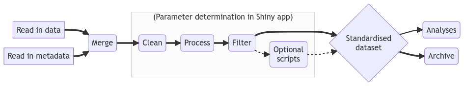

# How to use this app 📘

This app is designed to let the user explore how input parameters at various stages of data processing influence the output. The choices of these input parameter values can be nuanced but have a large influence on downstream outputs.

 

### Important Links 🔗

-   The GitHub repository for this project can be found [here](https://github.com/ExMove/ExMove)
-   The link to `Workflow.R` can be found [here](https://github.com/ExMove/ExMove/blob/main/R/Workflow.R)
-   The ExMove website can be found [here](https://exmove.github.io/)

 

### Step-by-step guide 👣

#### 0. Format data for app

-   In order for your own tracking data to work in the app it must be in the right format
-   When following the `Workflow.R` script then you should read in the script named `XX_diagnostic.csv`

#### 1. Read in data

-   Use the `Upload data (.csv)` button in the top left corner to read in a csv file of your data
-   There is also a test data set that can be loaded in by pressing the `Use Test Data` button in the top left

#### 2. Data filter tab

-   This tab applies preliminary filter to your data set. These checks ensures the data set does not contain any erroneous data points
-   The user can filter by speed and net displacement values that are highly improbable based on the users knowledge of the study system
-   The user can also remove data for a certain number of days after tag deployment, as animals do not always behave normally during this period
-   This filtered data set in then used in all subsequent tabs if it is carried out

#### 3. Forging trip tab

-   Users can classify foraging trips for animals that are central placed foragers
-   User can alter the distance from the central place and duration that a putatigve trip must exceed in order to be classified as a foraging trip
-   The central place can also be defined with a `shapefile` read in by the user

#### 4. Sub-sampling tab

-   Users can alter the temporal sampling resolution of their data.
-   Data is generally made more coarse so that sampling intervals are consistent across individuals and tag types.
-   This is important step when comparing distances between fixes as different sampling intervals may capture different tortuosity in real life movements

#### 5. Segmenting tab

-   Users can split up their movement tracks into multiple segments
-   Tracks are segmented based on a maximum duration between locations that is defined by the users and short segements can be removed
-   This is an important step when using hidden markov models as this modelling approach consistent sampling intervals

#### 6. Interactive map tab

-   This tab contains an interactive leaflet map of your tracking data
-   There are options to colour movement tracks by derived variables and display different individuals

   

### Overall Workflow 📈

If you're using the app, it likely means that you're already up and running with the `Workflow.R` script, and have merged, filtered and processed some data. The diagram below will hopefully give you an idea of how this Shiny app fits into the rest of the steps in the workflow:

 

### Authors 🖋️

-   Liam Langley 💃
-   Stephen Lang 🧙
-   Luke Ozsanlav-Harris 🤪
-   Alice Trevail 🏃️
